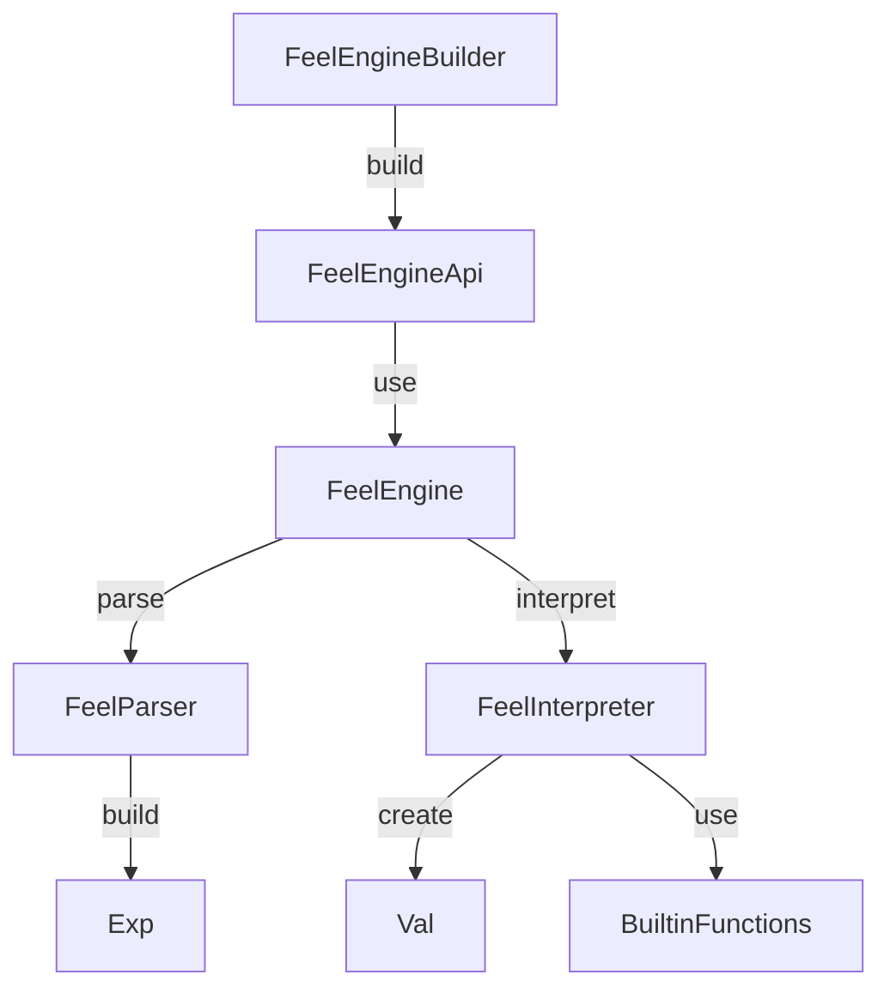

# Contributing to FEEL-Scala

:tada: First off, thanks for taking the time to contribute! :+1:

## How can I contribute?

### Reporting bugs

If you found a bug or unexpected behavior, please create a [new issue](https://github.com/camunda/feel-scala/issues). Before you create an issue, please make sure that there is no issue yet. Any information you provide on the issue would be helpful to solve it.

### Suggesting enhancements

If you have an idea of how to improve the project, please create a [new issue](https://github.com/camunda/feel-scala/issues). Describe your idea and the motivation behind it. To speed up the process, think about providing a pull request.

### Providing pull requests

Do you want to provide a bug fix or an improvement? Great! :tada:

Before you start coding, make sure that there is a related issue. The issue helps to confirm that the behavior is unexpected, or the idea of the improvement is valid. (Following the rule "Talk, then code")

Before you open a pull request:
* Make sure that you write new tests for the changed behavior 
* Run all tests to verify you don't break anything
* Build the project with Maven to format the code

If you added a new feature, please add it to the [Camunda docs](https://docs.camunda.io/docs/next/components/modeler/feel/language-guide/feel-expressions-introduction/) by contributing its documentation to the [repository](https://github.com/camunda/camunda-docs).   

## Building the project from source

You can build the project with [Maven](http://maven.apache.org). 

In the root directory:

Run the tests with
```
mvn test
```

Build the JAR files with
```
mvn install
```

## Styleguides

### Source code

Scala code is formatted using [Scalafmt](https://scalameta.org/scalafmt/). The formatting is integrated in the build process.

### Git commit messages

Commit messages should follow the [Conventional Commits](https://www.conventionalcommits.org/en/v1.0.0/#summary) format.

For example:

```
feat: add random() function

* add new built-in function random()
* it returns a random number between 0.0 and 1.0
```

Available commit types:

* `feat` - enhancements, new features
* `fix` - bug fixes
* `refactor` - non-behavior changes
* `test` - only changes in tests
* `docs` - changes in the documentation, readme, etc.
* `style` - apply code styles
* `build` - changes to the build (e.g. to Maven's `pom.xml`)
* `ci` - changes to the CI (e.g. to GitHub-related configs)

## Guide for common contributions

If you're new and want to contribute to the project, check out the following step-by-step guides for common contributions.

### Adding a new built-in function

Example: Add a new string function `reverse(value: string): string` 

* Implement the function in [StringBuiltinFunctions.scala](src/main/scala/org/camunda/feel/impl/builtin/StringBuiltinFunctions.scala)
  * Note: the built-in functions are grouped by their main argument type
  * Add a new private method `reverseFunction` and use the method `builtinFunction()`
  * `params` returns the argument list: `params = List("value")`
  * `invoke` is called when the function is invoked
  * It uses pattern-matching for the function parameters, the parameter order is the same in the argument list: `invoke = { case List(ValString(value)) => ??? }`
  * Return the function result `ValString(value.reverse)`
  * If the function can't return a successful result, return `ValError("something went wrong")` instead
* Verify the behavior by writing test cases in [BuiltinStringFunctionsTest.scala](src/test/scala/org/camunda/feel/impl/builtin/BuiltinStringFunctionsTest.scala)  
  * Add a new test case following the pattern: `"A reverse() function" should "return a string in reverse order" in { ??? }`
  * Add more test cases for other results, alternative parameters, or covering edge cases
  * Group all test cases for a method using `it should "return null if the argument is not a string" in { ??? }`
  * Add one test case that invokes the function with named arguments: `reverse(value: "adnumac")`
  * If the function returns an error, verify the error in the test case: `should (returnNull() and reportFailure(FUNCTION_INVOCATION_FAILURE, "Failed to invoke function 'reverse': something went wrong"))`
* Run all tests to verify the behavior
* Run the Maven build to format the code
* Open a pull request and link to the FEEL issue
* Then, document the function in the [Camunda docs](https://docs.camunda.io/docs/next/components/modeler/feel/builtin-functions/feel-built-in-functions-introduction/)
  * Navigate to the page [String functions](https://docs.camunda.io/docs/next/components/modeler/feel/builtin-functions/feel-built-in-functions-string/)
  * Click on `Edit this page` at the bottom
  * Add the function to the page, describe the behavior, and provide a few examples
  * Open a pull request and link to the FEEL issue and your pull request   

### Fix or extend the evaluation

Example: Zero-bases index list access `[1,2,3][0]` instead of `[1,2,3][1]` 

* Adjust the list access in [FeelInterpreter.scala](src/main/scala/org/camunda/feel/impl/interpreter/FeelInterpreter.scala)
  * Note: The entry point of the evaluation is `def eval(expression: Exp)`
  * Note: The list access is parsed as `Filter(list, filter)`
  * Note: Inspect the call hierarchy starting from `def eval(expression: Exp)` and looking for `case Filter(list, filter) =>`   
  * Change the access behavior in `private def filterList(list: List[Val], index: Number)`
* Adjust the relevant test cases in [InterpreterListExpressionTest.scala](src/test/scala/org/camunda/feel/impl/interpreter/InterpreterListExpressionTest.scala)
  * Note: The test cases are grouped by value type   
* Run all tests to verify that other cases are not broken
* Run the Maven build to format the code
* Open a pull request and link to the FEEL issue
* Then, adjust the documentation in the [Camunda docs](https://docs.camunda.io/docs/components/modeler/feel/language-guide/feel-list-expressions/#get-element)

### Fix or extend the parsing

Modifying the FEEL parser is more complex and requires some knowledge about the parsing library. Here are some useful resources:
* [FastParse documentation](https://com-lihaoyi.github.io/fastparse/) 
* [Blog: Easy Parsing with Parser Combinators](https://www.lihaoyi.com/post/EasyParsingwithParserCombinators.html) 
* [Blog: Build your own Programming Language with Scala](https://www.lihaoyi.com/post/BuildyourownProgrammingLanguagewithScala.html)

Example: Add the nullish coalescing operator `null ?? "default"`

* Extend the parsing model in [Exp.scala](src/main/scala/org/camunda/feel/syntaxtree/Exp.scala)
  * Add a new type `case class NullishCoalescing(value: Exp, alternative: Exp) extends Exp`
* Extend the parsing behavior in [FeelParser.scala](src/main/scala/org/camunda/feel/impl/parser/FeelParser.scala)
  * Add a new private method: `private def nullishCoalesching[_: P](value: Exp): P[Exp] = ???`
  * Implement the parser: `P("??" ~ expLvl4)`
  * Note: the parser uses levels for a hierarchy to define precedence and avoid left recursion 
  * Build the parsed expression: `.map { NullishCoalescing(value, _) }`
  * Add the new parser to the suitable level `| nullishCoalesching(value)`
* Handle the new operator in [FeelInterpreter.scala](src/main/scala/org/camunda/feel/impl/interpreter/FeelInterpreter.scala)
  * Add a case in `def eval(expression: Exp)` with: `case NullishCoalescing(value, alternative) => ???`
  * Implement the behavior and return `eval(value)` or `eval(alternative)` 
* Verify the behavior by writing test cases in [InterpreterBooleanExpressionTest.scala](src/test/scala/org/camunda/feel/impl/interpreter/InterpreterBooleanExpressionTest.scala)
  * Add a new test case following the pattern: `"A nullish coalescing operator" should "return the value if the given value is not null" in { ??? }`
  * Add more test cases for other results, or covering edge cases
  * Group all test cases for a method using `it should "return the alternative if the given value is null" in { ??? }`
* Run all tests to verify the behavior
* Run the Maven build to format the code
* Open a pull request and link to the FEEL issue
* Then, add the new operator to the documentation in the [Camunda docs](https://docs.camunda.io/docs/next/components/modeler/feel/language-guide/feel-boolean-expressions/)

## Architecture overview

The following diagram shows an overview of the different components within the FEEL engine:



## Public API and backward compatibility

The FEEL engine is integrated into Camunda 7 and Camunda 8. It's important to keep the public API stable and stay backward compatible to avoid breaking the integration in Camunda 7/8 or the userspace (i.e. the application that uses FEEL expressions). 

Concrete:
* The API of the following classes must remain binary backward compatible
  * Any class in a package namespace that does not contain `impl`, especially
    * `FeelEngine`
    * The custom function mechanism
    * Value mappers
* The following behavior must remain as is
  * Ability to compile expressions independently of evaluation
  * Ability to compile and evaluate expressions at once
  * Expression evaluation
    * Input and return type handling of expressions, e.g. the returned type of an expression should not change
    * The result of an expression unless it is a clear bug according to the DMN specification
* Supported environments
  * Minimal Java version: 11 (Camunda 7)
  * Java 21 (Camunda 8)

Technically:
* The binary backward compatibility is validated using the [clirr-maven-plugin](https://www.mojohaus.org/clirr-maven-plugin/)
* The engine behavior is verified by the unit tests  
* The supported environments are checked via GibHub actions 

Any change or violation of the above must be accepted by the maintainers of Camunda 7 and Camunda 8 to avoid a team/product getting "locked out".

## Building the documentation

The documentation is located in the `/docs` folder. It is built with [Docusaurus](https://v2.docusaurus.io/)

For development, use the following command (build + serve + auto-reload):
```
npm run start
```

The documentation is published using GitHub actions.

## Building a new release

> [!NOTE]
> Only for Camunda developers. 

Open the Camunda Slack channel [#ask-dmn-feel](https://camunda.slack.com/archives/C01QYD808A3). Click on the bookmark "Release FEEL-Scala" and follow the instructions. 🏗️
